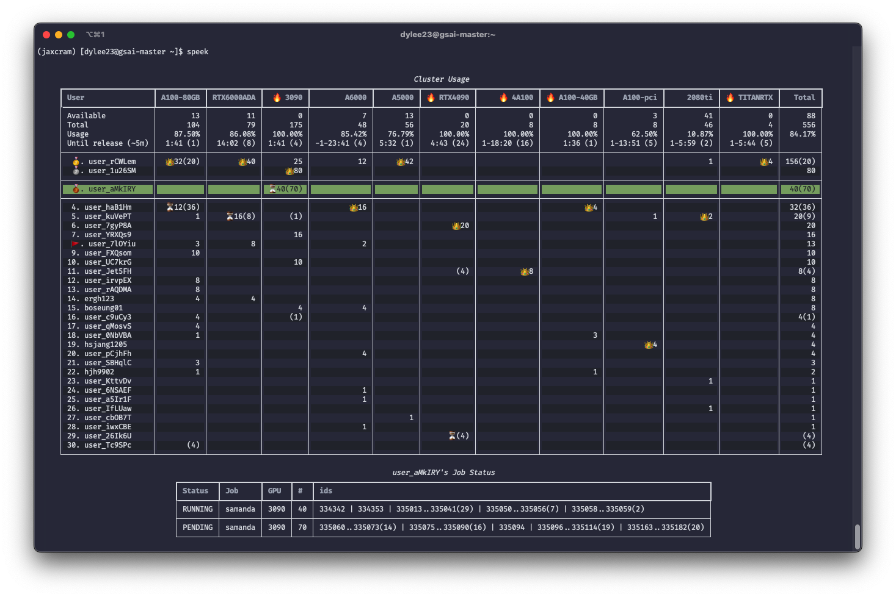

# 🔍 speek

**speek** lets you peek into slurm resource info such as GPU avaiability, usage per user, job status, and more.



<!-- > [!NOTE]
>
> See also the GitHub official GitHub Pages Action first.
>
> - [GitHub Pages now uses Actions by default | The GitHub Blog](https://github.blog/2022-08-10-github-pages-now-uses-actions-by-default/)
> - [GitHub Pages: Custom GitHub Actions Workflows (beta) | GitHub Changelog](https://github.blog/changelog/2022-07-27-github-pages-custom-github-actions-workflows-beta/) -->

## Installation
```sh
pip install git+https://github.com/edong6768/speek.git
```


## Usage
> [!Important]
> Make sure to activate the conda environment that has speek installed before using it.

```sh
$ speek [-h] [-u USER] [-l] [-f FILE] [-t T_AVAIL]
```

|Options (short)|Options (long)|Description|
|-|-|-|
|`-h`|`--help`|show this help message and exit|
|`-u` `USER`|`--user` `USER`| Specify highlighted user. (default: self) |
|`-l`|`--live`| Live display of speek every 1 seconds. |
|`-f` `FILE`|`--file` `FILE`| Specify file for user info. |
|`-t` `T_AVAIL`|`--t_avail` `T_AVAIL`| Time window width for upcomming release in {m:minutes, h:hours, d:days}. (default: 5 m) |


## Structure and Tag

### Partition usage
|Tag|Usage|
|-|-|
|☠️|100%|
|🔥|90~100%|
|❄️|0~10%|
|🏖️|0%|

### User usage
|Tag|Description|
|-|-|
|🥇🥈🥉|First~Third place based on usage|
|🚩|Pareto line (🥇~🚩 consists 80% of usage)|
|👑|Top user of partition|
|⏳|Top pended user of partition|
